# Instalación de Zimbra
Vamos a utilizar la guía disponible en [este enlace](https://blog.zimbra.com/2018/01/install-zimbra-collaboration-8-8-ubuntu-16-04-lts/), para comenzar la instalación de zimbra.

## Preparando la máquina
La máquina objetivo requiere tres cosas.. Configurar un SplitDNS dentro de la máquina, preparar las interfaces de red, y tener correctamente configurados sus hosts.

### IP
Se configura una IP estática. En este caso, se utiliza la IP provista por la red interna de VBox.

Adicionalmente se configura el archivo resolv.conf para evitar problemas con la resolución de nombres.

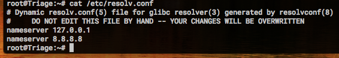

### Hosts
Luego editamos el archivo hosts. Hay que tener cuidado con esta parte ya que si se hace de manera incorrecta, la instalación falla en medio del proceso. Acá es necesario declarar nuestra configuración para el SplitDNS que deseamos, a modo de que pueda resolver la máquina su propia dirección.

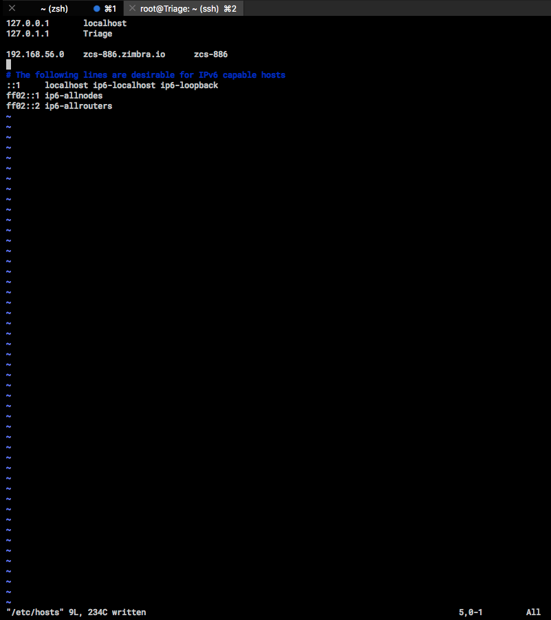

Luego de esto, se pueden reiniciar los servicios de red o bien reiniciar el equipo.

### SplitDNS
Para la configuración de splitDNS vamos a utilizar `dnsmask`, un servicio que nos permite levantar un servidor DNS en relativamente corto tiempo y sin tanta configuración.

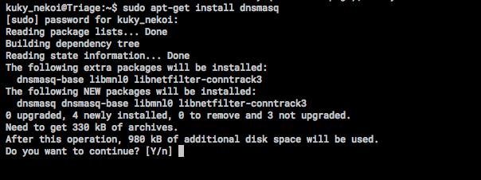

Por desgracia, durante el proceso de instalación se instaló también `bind9`, un servicio de DNS, el cual es necesario remover para el correcto funcionamiento de `dnsmasq`.

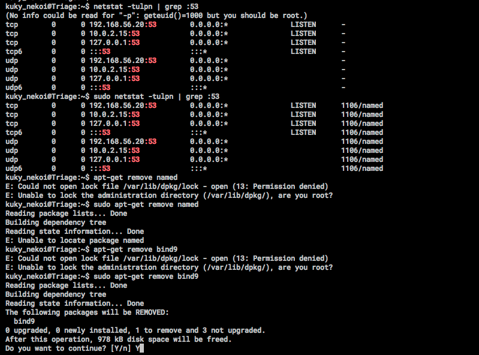

Luego `dnsmasq` puede ser utilizado normalmente.

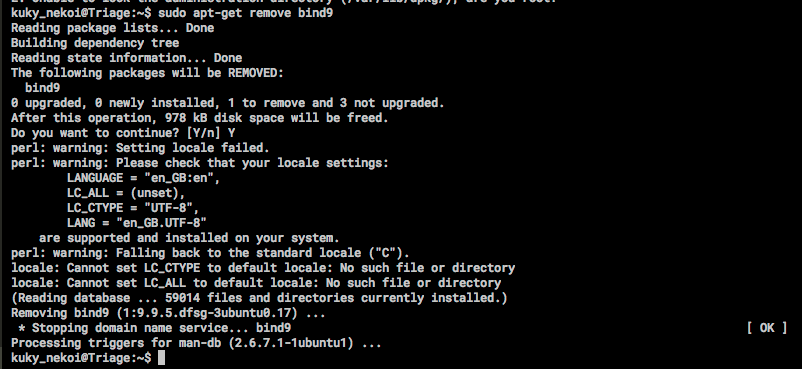

Luego de esto, es necesario cambiar la configuración de `dnsmasq`.

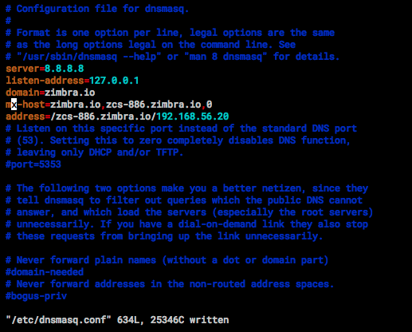

Finalmente, reiniciamos el servicio

Luego la guia sugiere realizar unas pruebas sobre este servidor para verificar que todo esté funcionando normalmente. Para esto utilizamos el comando `dig` para realizar una consulta DNS.

La parte importante de esto es la sección `ANSWER`, la cual debe recibir exactamente los mismos datos que les configuramos en los pasos anteriores.

## Instalando Zimbra
Antes que todo, es necesario obtener una licencia. Una vez que se tenga esta, se nos entregará un archivo por correo y tendremos acceso a la descarga. Necesitamos integrar ambos elementos dentro de nuestro entorno para poder instalar Zimbra (hey, software libre no quiere decir que sea gratis!).

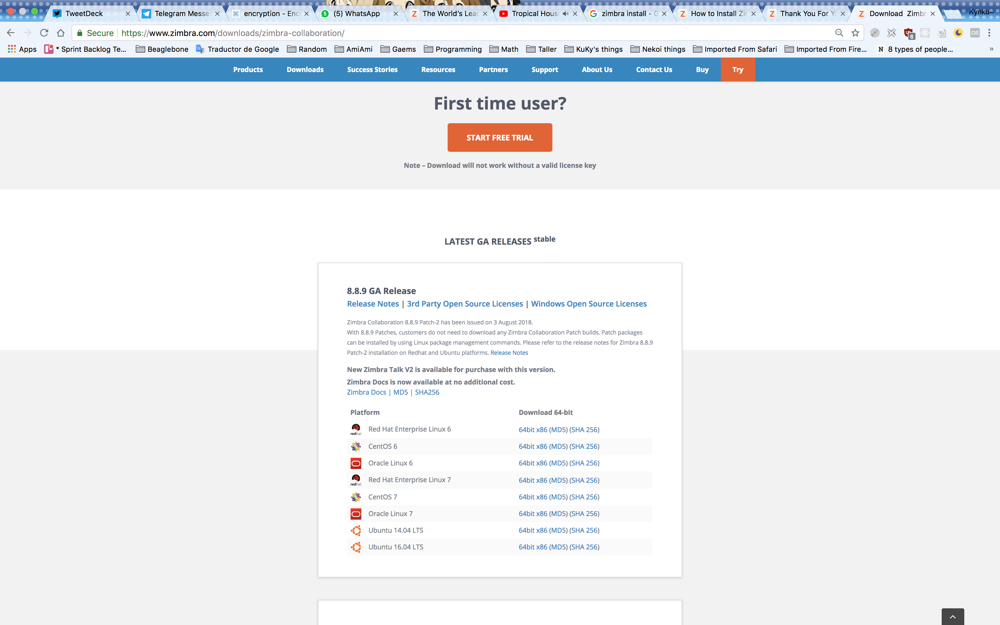

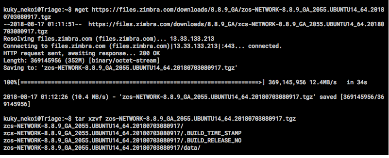

Luego de dar paso a la instalación de Zimbra, comienza la autoconfiguración de los servicios.

En nuestro caso falló porque nos equivocamos al setear el archivo hosts. 

Luego de esto, reiniciamos y luego de preguntarnos por las licencias, términos y condiciones y otras cosas comenzamos la instalación. Cuando pregunte si queremos usar los repositorios propios le indicamos que no, porque simplemente no tenemos ninguno.

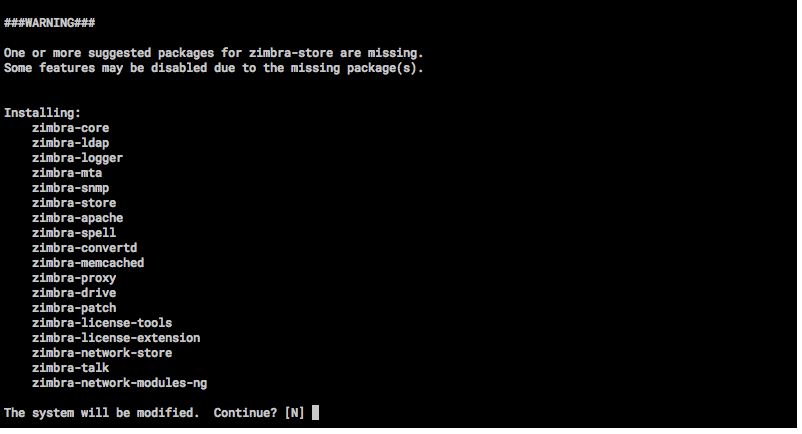

Acá no instalamos todos los paquetes, ya que hay algunos que son de carácter experimental como el cacheado de la DNS pero no lo tomamos en cuenta.

Luego de instalar los paquetes, nos preguntará si queremos cambiar la configuración del DNS. Claro, nos falta el registro MX por lo que no podemos hacer mucho. Le damos que si y continuamos.

Luego tenemos que entrar a configurar la contraseña de administrador. Aca se puede utilizar los comandos 6 y 4, para ingresar una contraseña nueva de administrador.

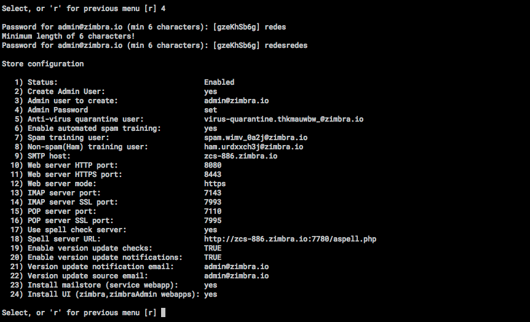

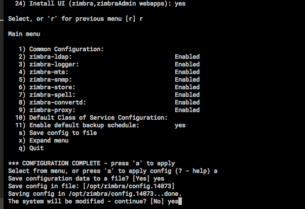

Finalmente, agregamos el DNS y abrimos el sitio.

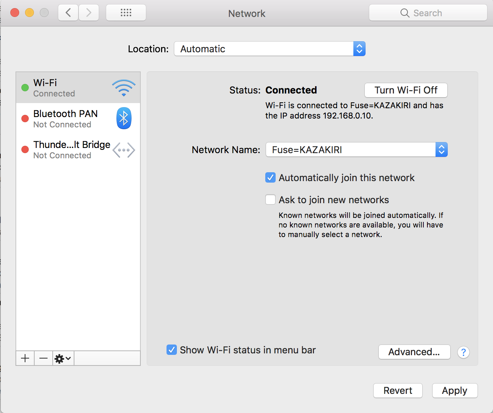

## Testing, todo falla

Si intentamos abrir el sitio, nos llevaremos una sorpresa porque el servidor DNS no funciona y ni siquiera podremos entrar por nuestra IP.

Esto es porque

1. No tenemos abierto el firewall
2. No tenemos declarado de `dnsmasq` escuche a otros lugares por su nombre.

Para solucionar lo primero, cambiamos la configuración de `ufw` y le agregamos el servicio Zimbra para que esté abierto. 

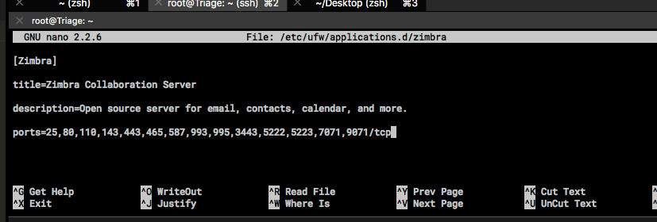

Pero tampoco va a funcionar nuestro DNS ya que aún tenemos bloqueado el puerto 53.

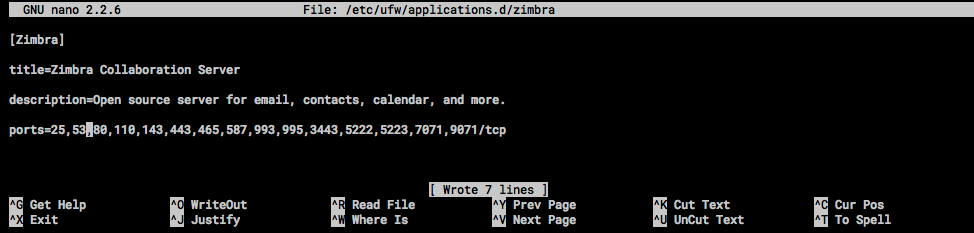

Luego de esto tenemos que verificar la configuración de `dnsmasq` la cual claramente está mal y cambiarla por una que esté bien configurada con el `listen-address`.

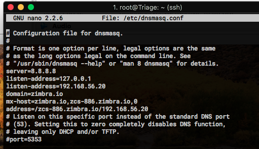

Y ahora nuestras queries desde otros equipos podrán funcionar bien.

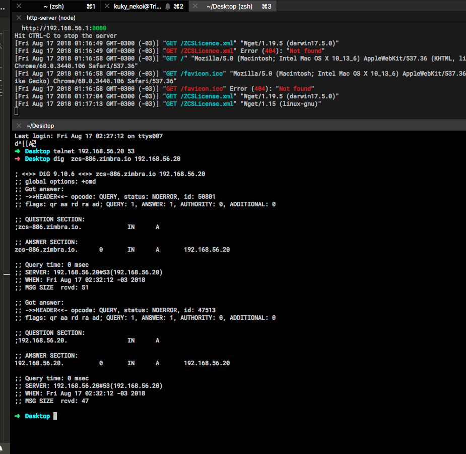

## Usando!

Luego de esto, Zimbra está listo para ser usado, con todos sus servicios.

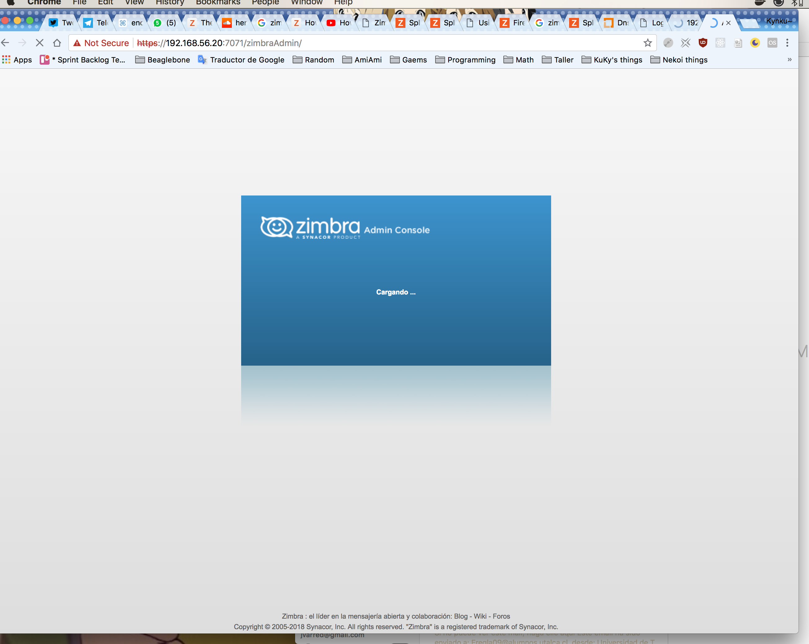

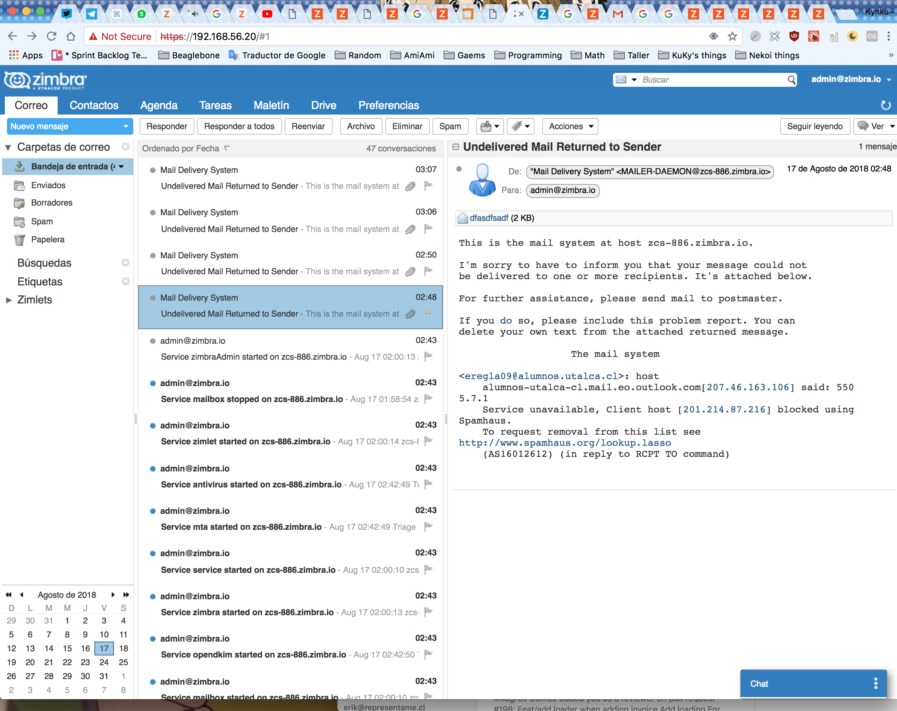

Pero los problemas continúan, ya que no se puede enviar correo de manera directa.

Para esto es necesario tener un relay, y para esto usaremos google basado en esta guia

https://wiki.zimbra.com/wiki/Outgoing_SMTP_Authentication

Sin embargo, el relay es harina de otro costal.