# Paso 2
```
Destination: Apple_44:0a:06 (8c:85:90:44:0a:06)
Source: Motorola_e8:88:c1 (a8:96:75:e8:88:c1)
```

Voy a trabajar con mi celular porque es lo que tengo a mi alcance.

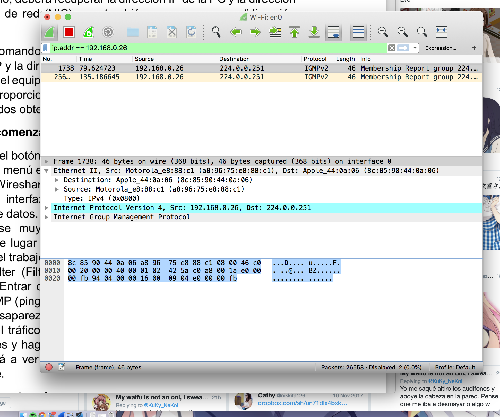

Acá apliqué el filtro (obligué el uso de la ip porque de otra forma no se vería nada)

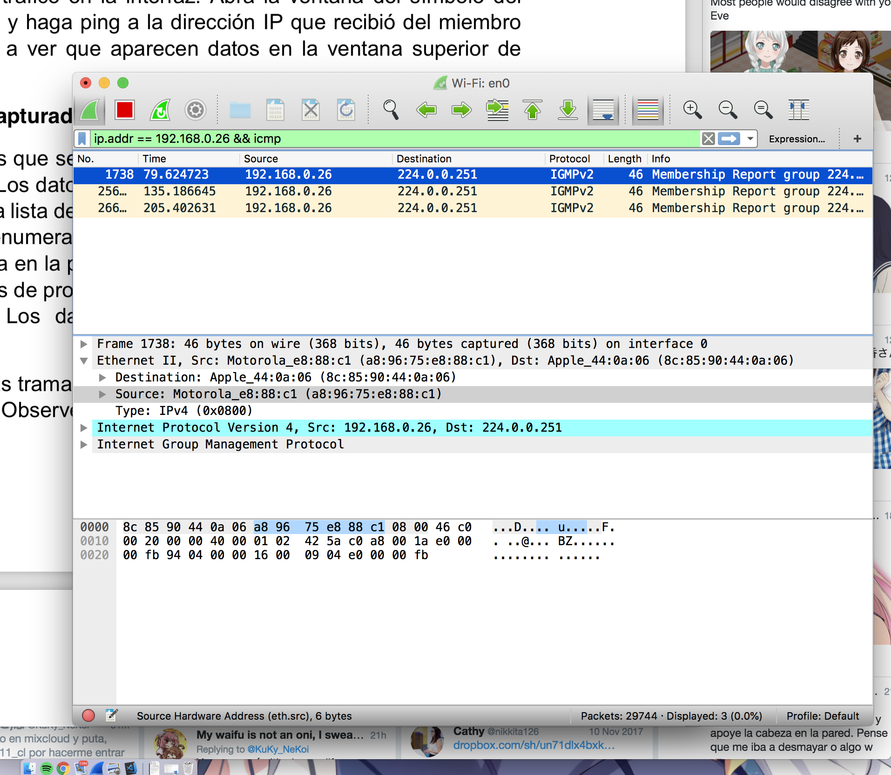

Sip, las direcciones coinciden. 
La dirección MAC es obtenida a través de la información que va en la trama ethernet.
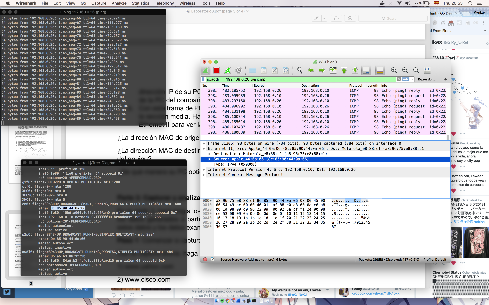
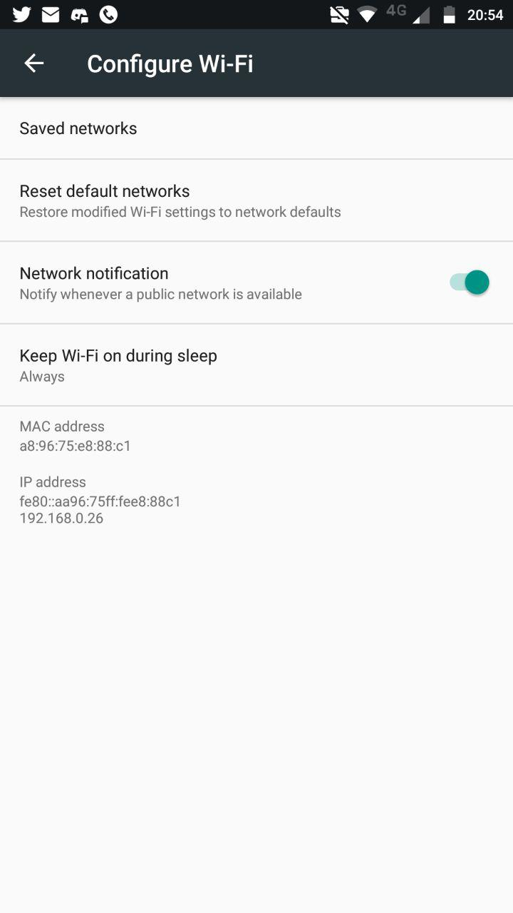

# Parte 3
Acá lo hice por medio de http porque para efectos de la tarea da lo mismo.
```
Destination: ArrisGro_99:da:60 (c0:05:c2:99:da:60)
Source: Apple_44:0a:06 (8c:85:90:44:0a:06)
```
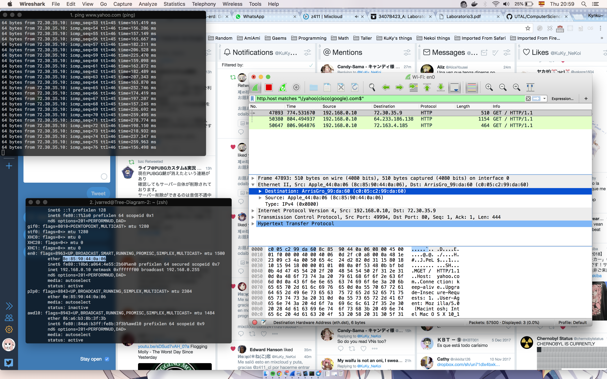
```
Destination: ArrisGro_99:da:60 (c0:05:c2:99:da:60)
Source: Apple_44:0a:06 (8c:85:90:44:0a:06)
```

```
Destination: ArrisGro_99:da:60 (c0:05:c2:99:da:60)
Source: Apple_44:0a:06 (8c:85:90:44:0a:06)
```


Lo importante es que siempre la MAC apunta al enrutador de la casa.

Se diferencia del ping local en que ahora no tengo la MAC del equipo de destino.

Ahora, la información de la información local no se muestra por el paso entre las tramas. En esta, la información de la mac solo le interesa al enrutador, fuera de este no tiene mucho sentido llevarla. [Acá hay una respuesta más ilustradora](https://stackoverflow.com/questions/24434719/why-not-use-mac-addresses-instead-of-local-ips)

# Paso 4 
```
Destination: Apple_44:0a:06 (8c:85:90:44:0a:06)
Source: ArrisGro_99:da:60 (c0:05:c2:99:da:60)
```
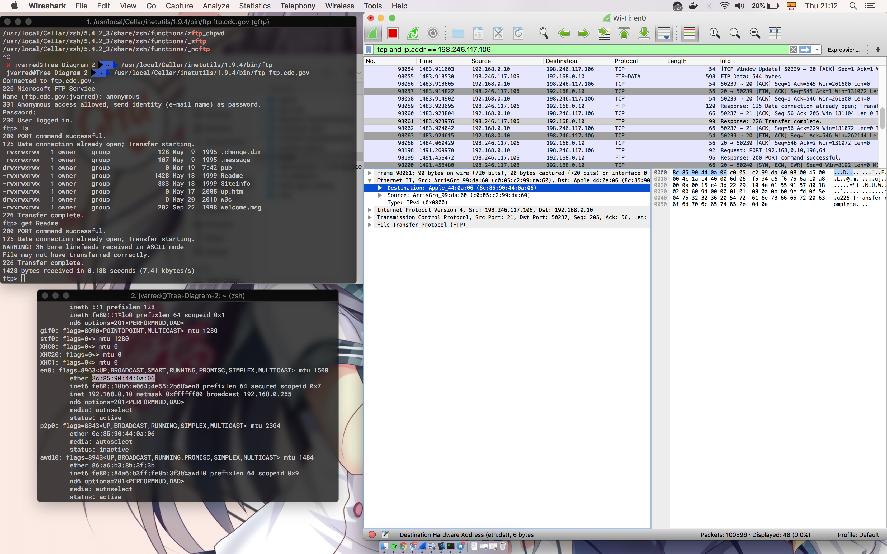

Acá está la captura que indica donde se transmite el nombre de usuario (sin encriptar obviamente~)
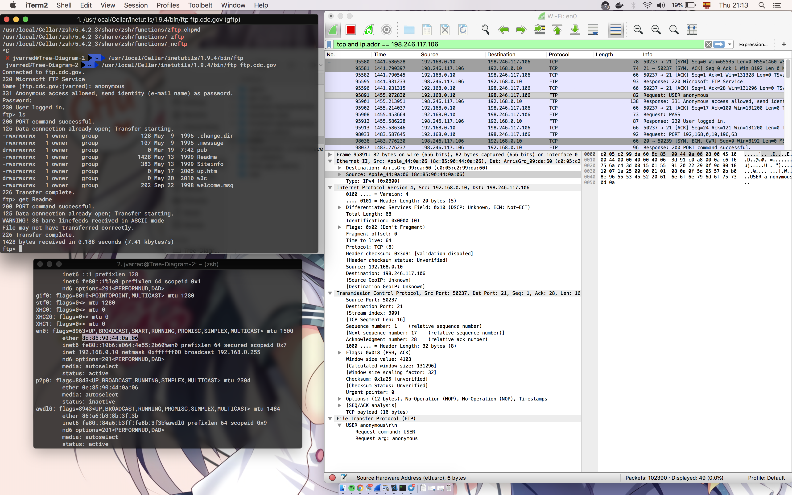

Y acá está donde se realizó la transferencia
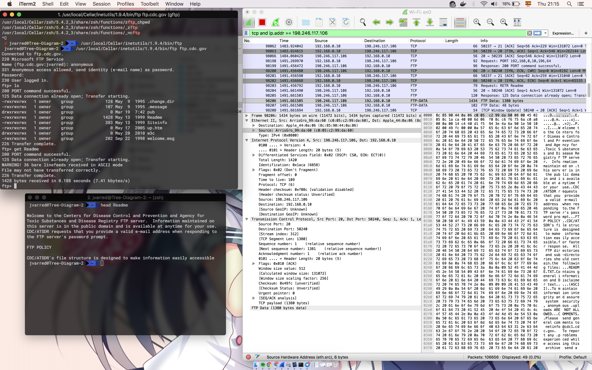

# Paso 5
```
Destination: ArrisGro_99:da:60 (c0:05:c2:99:da:60)
Source: 192.168.0.10
Source: Apple_44:0a:06 (8c:85:90:44:0a:06)
Destination: 190.110.100.6
```
Y si coincide con el navegador usado.

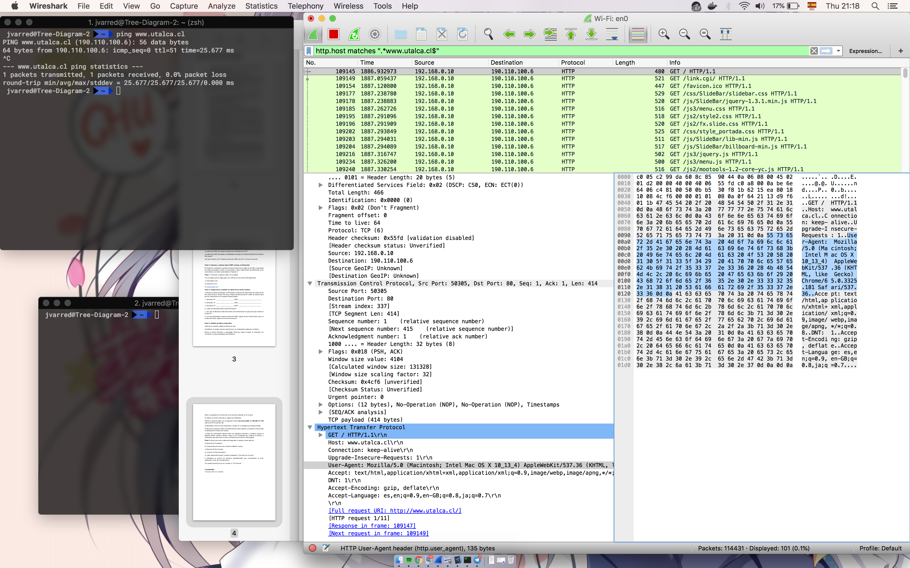

Y acá están las porciones hexa
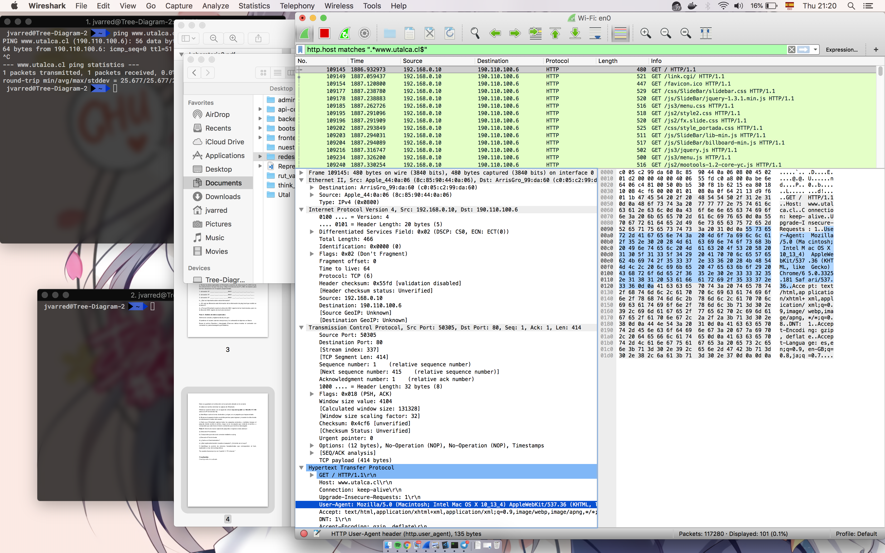
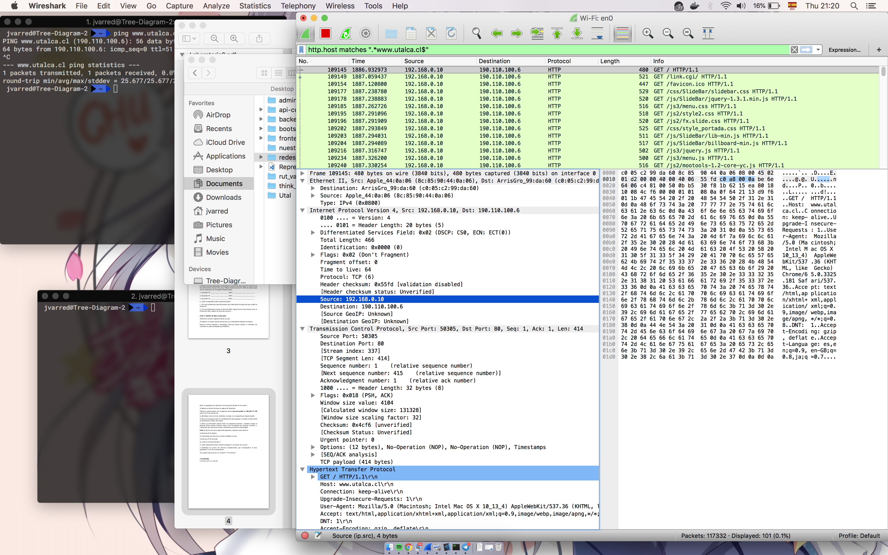

# Conclusión
Sorry por hacerla tarde.

