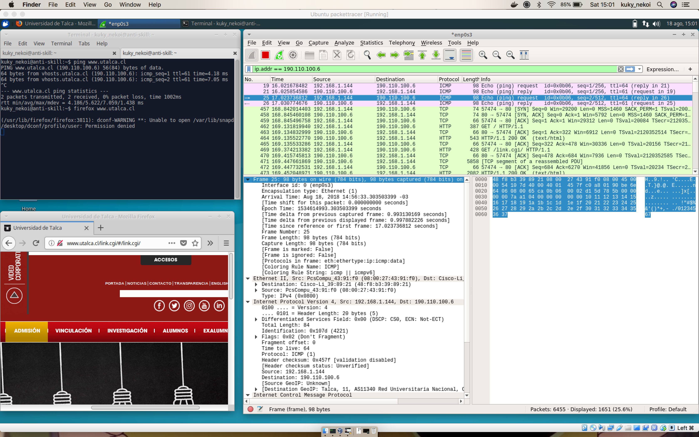
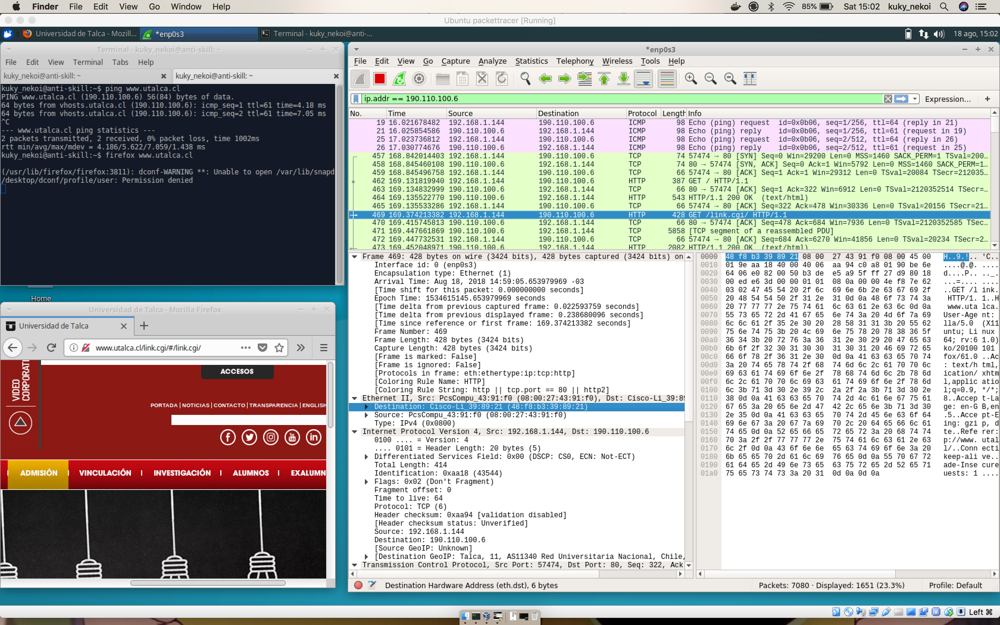
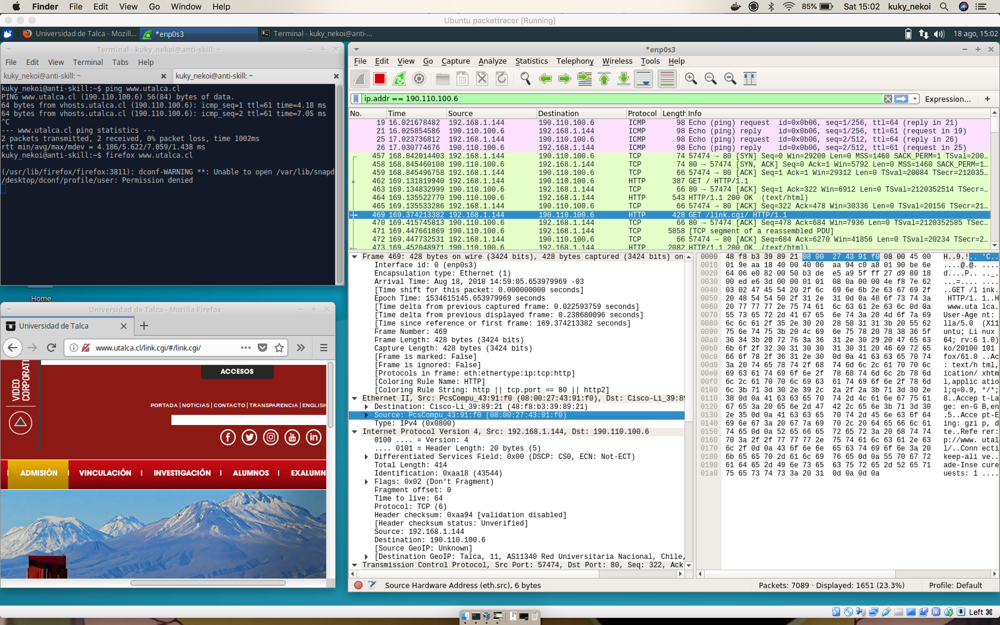
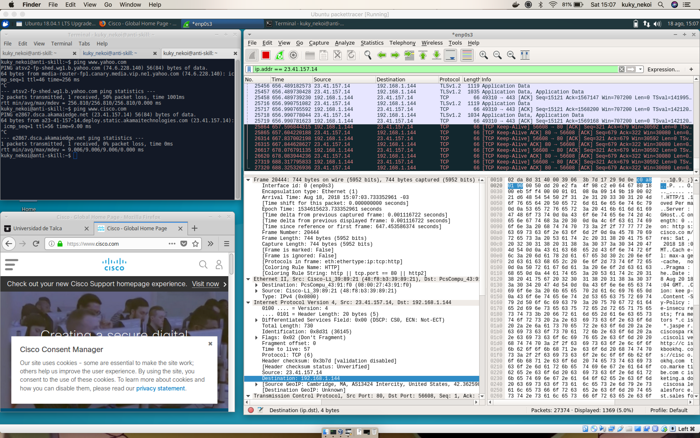
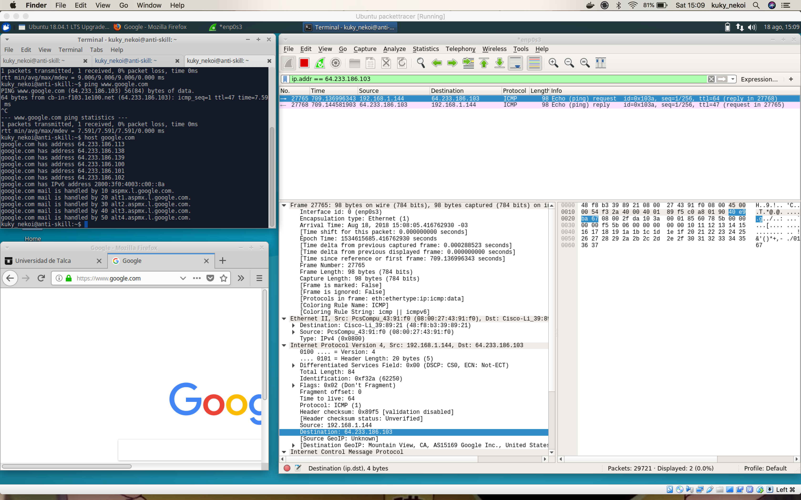

# Prueba
El resto de la prueba fue escrita, por lo que no está en este repositorio.

## Pregunta 1

### 1.a.- Dirección IP de destino
`190.110.100.6`

### 1.b.- Compruebe que la dirección es correcta  mediante un ping.


### 1.c.- Dirección IP de la fuente
`192.168.1.144`

### 1.d.- ¿Cuál es el host de destino?
`www.utalca.cl`

### 1.e.- ¿Qué versión del explorador muestra el paquete? ¿Coincide?
`Mozlilla 5`. Si coincide aproximadamente, de todas maneras es la que manifiesta el cliente.

### 1.f.- Identifique la porcion hexa del destino, fuente y mac.


### 1.g Haga una nueva captura con los sitios `www.yahoo.com` `www.cisco.com` y `www.google.com` y diga si existen diferencias.
Las diferencias son principalmente las direcciones, ya que la mayoría de la comunicación se lleva a cabo entre el equipo y el enrutador, por tanto detalles del hardware son omitidos durante la transmisión. Adicionalmente no se captura el tráfico de las ip de `yahoo.com` ni `google.com` ya que estas sirven el tráfico a través de balanceadores con diferentes IPs las que son asignadas durante el proceso de descubrimiento del dns. Por esto, ping revela una IP pero hosts otra y el trafico se hace por una de estas.



# 3: Genere un script con tres tareas en un crontab
## Crontab definition
```
0 8 * * 1-5 /home/kuky_nekoi/shutdown_staging.sh  > /var/log/rpi_aws.log
0 20 * * 1-5 /home/kuky_nekoi/poweron_staging.sh  > /var/log/rpi_aws.log
```

## Shellscript
Both scripts are intented to run on a RPi, in order to shudown and disconnect bastion servers when people is around office hours

shutdown_staging.sh
```bash
#!/bin/bash
echo "#############################"
echo "Execution time: $(date)"
# stop staging environment
public_ip="$(dig +short myip.opendns.com @resolver1.opendns.com)"
echo $public_ip > /tmp/public_address #this should be replaced with another directory

# revoke access to bastion
aws eb stop -f 
aws ec2 revoke-security-group-ingress --group-name bastion-development --protocol tcp --port 22 --cidr ${myip}/24
```

poweron_staging.sh
```bash
echo "#############################"
echo "Execution time: $(date)"
#!/bin/bash
# automatic updation of some packages
apt-get update
apt-get upgrade -y

# stop staging environment
public_ip=$(cat /tmp/public_address)

# revoke access to bastion
aws eb stop -f 
aws ec2 authorize-security-group-ingress --group-name bastion-development --protocol tcp --port 22 --cidr ${myip}/24
```

# 4 packet tracer

El [archivo .pkt](./packet_prueba.pkt) contiene la información de la red solicitada. No fue segurizado ningun router puesto que el problema era de enrutamiento + argumentos.

## Capturas


## Configuracion ospf

```
! router 0
enable
  configure terminal
    router ospf 10
      log-adjacency-changes
      network 200.33.146.0 0.0.0.3 area 10
      network 192.168.1.0 0.0.0.255 area 10
      passive-interface gigabitEthernet0/0
      passive-interface gigabitEthernet0/1
      passive-interface gigabitEthernet0/2
			redis static subnet
    exit
  exit  
  wr
exit

! router 1
enable
  configure terminal
    router ospf 10
      log-adjacency-changes
      network 200.33.146.0 0.0.0.3 area 10
      network 200.33.147.0 0.0.0.3 area 10
      network 172.16.1.0 0.0.0.255 area 10
      passive-interface gigabitEthernet0/0
      passive-interface gigabitEthernet0/1
      passive-interface gigabitEthernet0/2
			redis static subnet
    exit
  exit  
  wr
exit

! router 2
enable
  configure terminal
    router ospf 10
      log-adjacency-changes
      network 200.33.147.0 0.0.0.3 area 10
      network 10.1.50.0 0.0.0.255 area 10
      passive-interface gigabitEthernet0/0
      passive-interface gigabitEthernet0/1
      passive-interface gigabitEthernet0/2
			redis static subnet
    exit
  exit  
  wr
exit

```

## Argumento OSPF
* OSPF es un protocolo que no es privativo, por tanto podemos seguir extendiendo la red con otros productos que no sean CISCO.
* Las definiciones de area y que sea classless permite definir las máscaras solicitadas.
* Es fácil de utilizar.